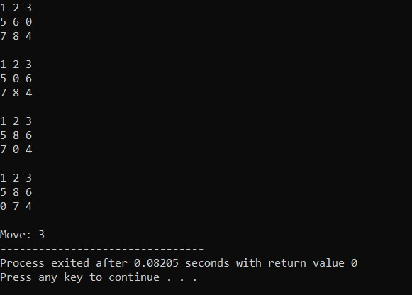
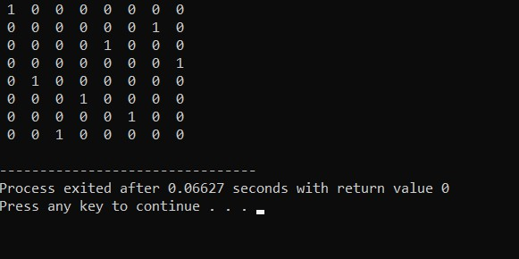
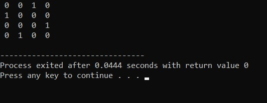

# KB-F_05111840000008

Anggara Yuda Pratama - 05111840000008  
Teknik Informatika - Fakultas Teknologi Elektro & Informatika Cerdas  
Institut Teknologi Sepuluh Nopember Surabaya

### Daftar Tugas
* [1.1 8-Puzzle BFS](https://github.com/anggarayp/KB-F_05111840000008#11-8-puzzle-bfs)
* [1.2 8-Puzzle DFS](https://github.com/anggarayp/KB-F_05111840000008#12-8-puzzle-dfs)
* [1.3 8-Puzzle IDS](https://github.com/anggarayp/KB-F_05111840000008#13-8-puzzle-ids)
* [1.4 8-Queen](https://github.com/anggarayp/KB-F_05111840000008#14-8-queen)
* [2.1 8-Puzzle Heuristic-1](https://github.com/anggarayp/KB-F_05111840000008/blob/master/README.md#21-8-puzzle-heuristic-1)
* [2.2 8-Puzzle Heuristic-2](https://github.com/anggarayp/KB-F_05111840000008/blob/master/README.md#22-8-puzzle-heuristic-2)
* [2.3 8-Queen_Hill Climbing](https://github.com/anggarayp/KB-F_05111840000008/blob/master/README.md#23-8-queen_hill-climbing)
* [3. Minimax - TicTacToe](https://github.com/anggarayp/KB-F_05111840000008/blob/master/README.md#3-minimax---tictactoe)
* [4. 4-Queen](https://github.com/anggarayp/KB-F_05111840000008#4-4-queen)

### 1.1 8-Puzzle BFS
BFS `(Breadth-First Search)` adalah algoritma yang melakukan pencarian secara melebar yang mengunjungi simpul secara preorder yaitu mengunjungi suatu simpul kemudian mengunjungi semua simpul yang bertetangga dengan simpul tersebut terlebih dahulu.

BFS menggunakan struktur data `queue` yang merupakan struktur data `First In`, `First Out` atau `FIFO`. Antrian ini menyimpan semua node yang harus kita jelajahi dan setiap kali sebuah node dieksplorasi ditambahkan ke set node yang dikunjungi.

Algoritma BFS :


[Source Code](https://github.com/anggarayp/KB-F_05111840000008/blob/master/1.1%208-Puzzle%20BFS/bfs.cpp)

Pertama, menyatakan space simpul pohon terlebih dahulu
```c
struct Node { 
	// menyimpan simpul induk dari simpul saat ini
	// membantu dalam melacak jejak ketika jawabannya ditemukan
	Node* parent; 
	
	// menyimpan matrix 
	int mat[N][N]; 

	// menyimpan koordinat tile yang kosong kosong
	int x, y;

	// menyimpan jumlah gerakan sejauh ini
	int level;
}; 
```

Ini merupakan fungsi untuk mencetak matriks N x N
```c
int printMatrix(int mat[N][N]) 
{ 
	for (int i = 0; i < N; i++) 
	{ 
		for (int j = 0; j < N; j++) 
			printf("%d ", mat[i][j]); 
		printf("\n"); 
	} 
}
```

Ini merupakan fungsi untuk mengalokasikan node baru
```c
Node* newNode(int mat[N][N], int x, int y, int newX, 
			int newY, int level, Node* parent) { 
	Node* node = new Node; 

	// atur pointer untuk path ke root 
	node->parent = parent; 

	// menyalin data dari node induk ke node saat ini 
	memcpy(node->mat, mat, sizeof node->mat); 

	// pindahkan tile dengan 1 posisi 
	swap(node->mat[x][y], node->mat[newX][newY]); 

	// atur jumlah gerakan sejauh ini
	node->level = level; 

	// perbarui koordinat tile kosong yang baru
	node->x = newX; 
	node->y = newY; 

	return node; 
} 
```

Menentukan row dan column
```c
int row[] = { 1, 0, -1, 0 }; 
int col[] = { 0, -1, 0, 1 }; 
```

Fungsi untuk memeriksa apakah (x, y) adalah koordinat matriks yang valid.
```c
int isSafe(int x, int y) { 
	return (x >= 0 && x < N && y >= 0 && y < N); 
} 
```

Fungsi untuk mencetak path dari simpul akar ke simpul tujuan
```c
void printPath(Node* root) { 
	if (root == NULL) 
		return; 
	printPath(root->parent); 
	printMatrix(root->mat); 

	printf("\n"); 
} 

bool checkGoal (int mat[N][N],int final [N] [N]) {
 	for (int i = 0; i < N; i++) 
	{ 
		for (int j = 0; j < N; j++) 
			if (mat [i] [j] != final [i] [j]) 
			return false;
	}
	 
 	return true;
 }
```

Fungsi dibawah untuk memecahkan algoritma puzzle N * N - 1 menggunakan `Branch And Bound`. x dan y adalah koordinat ubin kosong dalam kondisi awal.
```c
void solve(int initial[N][N], int x, int y, 
		int final[N][N]) { 
	
	// Buat antrian prioritas untuk 
	//menyimpan node langsung dari pohon pencarian; 
	queue <Node*> pq;
	
	// buat simpul root dan hitung biayanya
	Node* root = newNode(initial, x, y, x, y, 0, NULL); 
	
	// tambahkan root ke daftar node langsung
	pq.push(root); 

	// Menemukan simpul hidup dengan biaya paling sedikit,
	// tambahkan anak-anaknya ke daftar node langsung dan
	// akhirnya menghapusnya dari daftar. 
	while (!pq.empty()) { 
		// Temukan node langsung dengan perkiraan biaya terendah
		Node* min = pq.front(); 
		//Node* min = pq.top();

		// Node yang ditemukan dihapus dari daftar live node
		pq.pop(); 
		
		// jika min adalah simpul jawaban
		if (checkGoal (min->mat, final)) { 
			// cetak jalur dari root ke tujuan 
			printPath(min); 
			printf ("Move: %d",min->level);
			return; 
		} 
		
		// lakukan untuk setiap child minimal 4 anak untuk sebuah simpul
		for (int i = 0; i < 4; i++) { 
			if (isSafe(min->x + row[i], min->y + col[i])) { 
				// buat simpul anak dan hitung biayanya
				Node* child = newNode(min->mat, min->x, 
							min->y, min->x + row[i], 
							min->y + col[i], 
							min->level + 1, min);  

				// Tambahkan anak ke daftar node langsung 
				pq.push(child); 
			} 
		} 
	} 
} 
```

Lalu masuk ke program driver untuk menguji fungsi di atas. Untuk ruang yang kosong, diinisiasi dengan nilai 0.
```c
int main() { 
	// Konfigurasi awal
	// Nilai 0 digunakan untuk ruang kosong
	int initial[N][N] = { 
		{1, 2, 3}, 
		{5, 6, 0}, 
		{7, 8, 4} 
	}; 

	// Konfigurasi final yang dapat dipecahkan
	// Nilai 0 digunakan untuk ruang kosong
	int final[N][N] = { 
		{1, 2, 3}, 
		{5, 8, 6}, 
		{0, 7, 4} 
	}; 

	// Koordinat petak kosong dalam konfigurasi awal
	int x = 1, y = 2; 

	solve(initial, x, y, final); 

	return 0; 
} 
```

**Hasil :**



Dari gambar diatas menunjukkan bahwa jumlah langkah yang ditempuh sebanyak 3 kali dengan waktu 0,082 seconds.

### 1.2 8-Puzzle DFS
Algoritma DFS `(Depth First Search)` adalah salah satu algoritma yang digunakan untuk pencarian jalur. Contoh yang dibahas kali ini adalah mengenai pencarian jalur yang melalui semua titik.

Depth First Search menggunakan struktur data `stack` sebagai lawan dari queue yang digunakan Breadth First Search.

Semua node pada metode DFS ini akan dikunjungi di jalur saat ini sampai semua node yang belum dikunjungi telah dilalui setelah jalur berikutnya akan dipilih.


### 1.3 8-Puzzle IDS

### 1.4 8-Queen
[Source Code](https://github.com/anggarayp/KB-F_05111840000008/blob/master/1.4%208-Queen/8queen.cpp)

Awal-awal kita define N = 8, karena problemnya adalah 8-queen
```c
/* C/C++ program to solve N Queen Problem using 
backtracking */
#define N 4
#include <stdbool.h> 
#include <stdio.h> 
```

ld merupakan sebuah array di mana indeksnya mengindikasikan baris-col + N-1 (N-1) adalah untuk menggeser perbedaan untuk menyimpan indeks negatif. Sedangkan rd merupakan sebuah array di mana indeksnya mengindikasikan baris + col dan digunakan untuk memeriksa apakah seorang ratu dapat ditempatkan di diagonal kanan atau tidak. Untuk cl sendiri merupakan array kolom di mana indeksnya menunjukkan kolom dan digunakan untuk memeriksa apakah seorang ratu dapat ditempatkan di baris itu atau tidak
```c
int ld[30] = { 0 }; 

int rd[30] = { 0 }; 

int cl[30] = { 0 }; 
```

Fungsi utilitas rekursif untuk menyelesaikan problem N-Queen
```c
bool solveNQUtil(int board[N][N], int col) { 
	if (col >= N) 
		return true; 
    
	for (int i = 0; i < N; i++) { 
		if ((ld[i - col + N - 1] != 1 && 
				rd[i + col] != 1) && cl[i] != 1) { 
			
			board[i][col] = 1; 
			ld[i - col + N - 1] = 
						rd[i + col] = cl[i] = 1; 

	
			if (solveNQUtil(board, col + 1)) 
				return true; 
        
			board[i][col] = 0; // BACKTRACK 
			ld[i - col + N - 1] = 
						rd[i + col] = cl[i] = 0; 
		} 
	} 
	return false; 
}
```

Fungsi ini memecahkan masalah N Queen menggunakan Backtracking. Ini terutama menggunakan resolNQUtil () untuk menyelesaikan masalah. Ini mengembalikan false jika ratu tidak dapat ditempatkan, jika tidak, kembalikan benar dan mencetak penempatan ratu dalam bentuk 1s. Harap dicatat bahwa mungkin ada lebih dari satu solusi, fungsi ini mencetak salah satu solusi yang layak.
```c
bool solveNQ() { 
	int board[N][N] = { { 0, 0, 0, 0 }, 
						{ 0, 0, 0, 0 }, 
						{ 0, 0, 0, 0 }, 
						{ 0, 0, 0, 0 } }; 

	if (solveNQUtil(board, 0) == false) { 
		printf("Solution does not exist"); 
		return false; 
	} 

	printSolution(board); 
	return true; 
} 
```

Program driver untuk menguji fungsi di atas
```c
int main() { 
	solveNQ(); 
	return 0; 
} 
 ```

**Hasil :**



### 2.1 8-Puzzle Heuristic-1

### 2.2 8-Puzzle Heuristic-2

### 2.3 8-Queen_Hill Climbing

### 3. Minimax - TicTacToe

### 4. 4-Queen
[Source Code](https://github.com/anggarayp/KB-F_05111840000008/blob/master/4.%204-Queen/4queen.cpp)

Penjelasan kodingannya sama seperti [8-Queen](https://github.com/anggarayp/KB-F_05111840000008#14-8-queen), hanya saja N-nya di define = 4


```c
/* C/C++ program to solve N Queen Problem using 
backtracking */
#define N 4
#include <stdbool.h> 
#include <stdio.h> 
```

**Hasil :**


