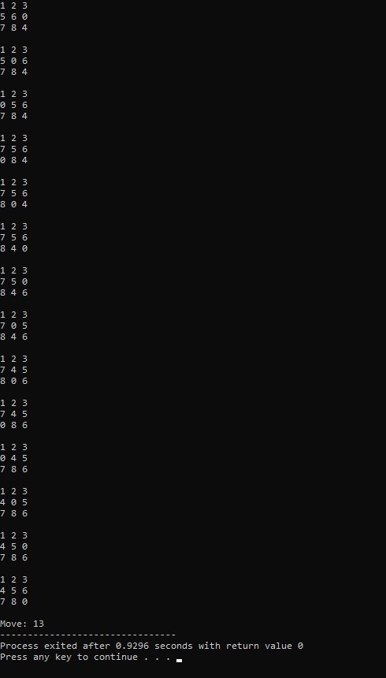

# KB-F_05111840000008

Anggara Yuda Pratama - 05111840000008  
Teknik Informatika - Fakultas Teknologi Elektro & Informatika Cerdas  
Institut Teknologi Sepuluh Nopember Surabaya

### Daftar Tugas
* [1.1 8-Puzzle BFS](https://github.com/anggarayp/KB-F_05111840000008#11-8-puzzle-bfs)
* [1.2 8-Puzzle DFS](https://github.com/anggarayp/KB-F_05111840000008#12-8-puzzle-dfs)
* [1.3 8-Puzzle IDS](https://github.com/anggarayp/KB-F_05111840000008#13-8-puzzle-ids)
* [1.4 8-Queen](https://github.com/anggarayp/KB-F_05111840000008#14-8-queen)
* [2. 8-Puzzle Heuristic-1](https://github.com/anggarayp/KB-F_05111840000008/blob/master/README.md#21-8-puzzle-heuristic)
* [2.1 8-Queen_Hill Climbing](https://github.com/anggarayp/KB-F_05111840000008/blob/master/README.md#21-8-queen_hill-climbing)
* [3. Minimax - TicTacToe](https://github.com/anggarayp/KB-F_05111840000008/blob/master/README.md#3-minimax---tictactoe)
* [4. 4-Queen](https://github.com/anggarayp/KB-F_05111840000008#4-4-queen)

### 1.1 8-Puzzle BFS
BFS `(Breadth-First Search)` adalah algoritma yang melakukan pencarian secara melebar yang mengunjungi simpul secara preorder yaitu mengunjungi suatu simpul kemudian mengunjungi semua simpul yang bertetangga dengan simpul tersebut terlebih dahulu.

BFS menggunakan struktur data `queue` yang merupakan struktur data `First In`, `First Out` atau `FIFO`. Antrian ini menyimpan semua node yang harus kita jelajahi dan setiap kali sebuah node dieksplorasi ditambahkan ke set node yang dikunjungi.

Algoritma BFS :


[Source Code](https://github.com/anggarayp/KB-F_05111840000008/blob/master/1.1%208-Puzzle%20BFS/bfs.cpp)

Pertama, menyatakan space simpul pohon terlebih dahulu
```c
struct Node { 
	// menyimpan simpul induk dari simpul saat ini
	// membantu dalam melacak jejak ketika jawabannya ditemukan
	Node* parent; 
	
	// menyimpan matrix 
	int mat[N][N]; 

	// menyimpan koordinat tile yang kosong kosong
	int x, y;

	// menyimpan jumlah gerakan sejauh ini
	int level;
}; 
```

Ini merupakan fungsi untuk mencetak matriks N x N
```c
int printMatrix(int mat[N][N]) { 
	for (int i = 0; i < N; i++) 
	{ 
		for (int j = 0; j < N; j++) 
			printf("%d ", mat[i][j]); 
		printf("\n"); 
	} 
}
```

Ini merupakan fungsi untuk mengalokasikan node baru
```c
Node* newNode(int mat[N][N], int x, int y, int newX, 
			int newY, int level, Node* parent) { 
	Node* node = new Node; 

	// atur pointer untuk path ke root 
	node->parent = parent; 

	// menyalin data dari node induk ke node saat ini 
	memcpy(node->mat, mat, sizeof node->mat); 

	// pindahkan tile dengan 1 posisi 
	swap(node->mat[x][y], node->mat[newX][newY]); 

	// atur jumlah gerakan sejauh ini
	node->level = level; 

	// perbarui koordinat tile kosong yang baru
	node->x = newX; 
	node->y = newY; 

	return node; 
} 
```

Menentukan row dan column
```c
int row[] = { 1, 0, -1, 0 }; 
int col[] = { 0, -1, 0, 1 }; 
```

Fungsi untuk memeriksa apakah (x, y) adalah koordinat matriks yang valid.
```c
int isSafe(int x, int y) { 
	return (x >= 0 && x < N && y >= 0 && y < N); 
} 
```

Fungsi untuk mencetak path dari simpul akar ke simpul tujuan
```c
void printPath(Node* root) { 
	if (root == NULL) 
		return; 
	printPath(root->parent); 
	printMatrix(root->mat); 

	printf("\n"); 
} 

bool checkGoal (int mat[N][N],int final [N] [N]) {
 	for (int i = 0; i < N; i++) 
	{ 
		for (int j = 0; j < N; j++) 
			if (mat [i] [j] != final [i] [j]) 
			return false;
	}
	 
 	return true;
 }
```

Fungsi dibawah untuk memecahkan algoritma puzzle N * N - 1 menggunakan `Branch And Bound`. x dan y adalah koordinat ubin kosong dalam kondisi awal.
```c
void solve(int initial[N][N], int x, int y, 
		int final[N][N]) { 
	
	// Buat antrian prioritas untuk 
	//menyimpan node langsung dari pohon pencarian; 
	queue <Node*> pq;
	
	// buat simpul root dan hitung biayanya
	Node* root = newNode(initial, x, y, x, y, 0, NULL); 
	
	// tambahkan root ke daftar node langsung
	pq.push(root); 

	// Menemukan simpul hidup dengan biaya paling sedikit,
	// tambahkan anak-anaknya ke daftar node langsung dan
	// akhirnya menghapusnya dari daftar. 
	while (!pq.empty()) { 
		// Temukan node langsung dengan perkiraan biaya terendah
		Node* min = pq.front(); 
		//Node* min = pq.top();

		// Node yang ditemukan dihapus dari daftar live node
		pq.pop(); 
		
		// jika min adalah simpul jawaban
		if (checkGoal (min->mat, final)) { 
			// cetak jalur dari root ke tujuan 
			printPath(min); 
			printf ("Move: %d",min->level);
			return; 
		} 
		
		// lakukan untuk setiap child minimal 4 anak untuk sebuah simpul
		for (int i = 0; i < 4; i++) { 
			if (isSafe(min->x + row[i], min->y + col[i])) { 
				// buat simpul anak dan hitung biayanya
				Node* child = newNode(min->mat, min->x, 
							min->y, min->x + row[i], 
							min->y + col[i], 
							min->level + 1, min);  

				// Tambahkan anak ke daftar node langsung 
				pq.push(child); 
			} 
		} 
	} 
} 
```

Lalu masuk ke program driver untuk menguji fungsi di atas. Untuk ruang yang kosong, diinisiasi dengan nilai 0.
```c
int main() { 
	// Konfigurasi awal
	// Nilai 0 digunakan untuk ruang kosong
	int initial[N][N] = { 
		{1, 2, 3}, 
		{5, 6, 0}, 
		{7, 8, 4} 
	}; 

	// Konfigurasi final yang dapat dipecahkan
	// Nilai 0 digunakan untuk ruang kosong
	int final[N][N] = { 
		{1, 2, 3}, 
		{4, 5, 6}, 
		{7, 8, 0} 
	};

	// Koordinat petak kosong dalam konfigurasi awal
	int x = 1, y = 2; 

	solve(initial, x, y, final); 

	return 0; 
} 
```

**Hasil :**



Dari gambar diatas menunjukkan bahwa jumlah langkah yang ditempuh sebanyak 3 kali dengan waktu 0,092 seconds.

### 1.2 8-Puzzle DFS
Algoritma DFS `(Depth First Search)` adalah salah satu algoritma yang digunakan untuk pencarian jalur. Contoh yang dibahas kali ini adalah mengenai pencarian jalur yang melalui semua titik.

Depth First Search menggunakan struktur data `stack` sebagai lawan dari queue yang digunakan Breadth First Search.

Semua node pada metode DFS ini akan dikunjungi di jalur saat ini sampai semua node yang belum dikunjungi telah dilalui setelah jalur berikutnya akan dipilih.


[Source Code](https://github.com/anggarayp/KB-F_05111840000008/blob/master/1.2%208-Puzzle%20DFS/dfs.cpp)

Pertama, menyatakan space simpul pohon terlebih dahulu
```c
struct Node { 
	// menyimpan simpul induk dari simpul saat ini
	// membantu dalam melacak jejak ketika jawabannya ditemukan
	Node* parent; 
	
	// menyimpan matrix 
	int mat[N][N]; 

	// menyimpan koordinat tile yang kosong kosong
	int x, y;

	// menyimpan jumlah gerakan sejauh ini
	int level;
}; 
```

Fungsi berikut merupakan fungsi untuk mencetak matriks N x N
```c
int printMatrix(int mat[N][N]) 
{ 
	for (int i = 0; i < N; i++) 
	{ 
		for (int j = 0; j < N; j++) 
			printf("%d ", mat[i][j]); 
		printf("\n"); 
	} 
}
```

Ini merupakan fungsi untuk mengalokasikan node baru
```c
Node* newNode(int mat[N][N], int x, int y, int newX, 
			int newY, int level, Node* parent) { 
	Node* node = new Node; 

	// atur pointer untuk path ke root 
	node->parent = parent; 

	// menyalin data dari node induk ke node saat ini 
	memcpy(node->mat, mat, sizeof node->mat); 

	// pindahkan tile dengan 1 posisi 
	swap(node->mat[x][y], node->mat[newX][newY]); 

	// atur jumlah gerakan sejauh ini
	node->level = level; 

	// perbarui koordinat tile kosong yang baru
	node->x = newX; 
	node->y = newY; 

	return node; 
} 
```

Menentukan row dan column
```c
int row[] = { 1, 0, -1, 0 }; 
int col[] = { 0, -1, 0, 1 }; 
```

Fungsi untuk memeriksa apakah (x, y) adalah koordinat matriks yang valid.
```c
int isSafe(int x, int y) { 
	return (x >= 0 && x < N && y >= 0 && y < N); 
} 
```

Fungsi untuk mencetak path dari simpul akar ke simpul tujuan
```c
void printPath(Node* root) { 
	if (root == NULL) 
		return; 
	printPath(root->parent); 
	printMatrix(root->mat); 

	printf("\n"); 
} 

bool testing (int mat[N][N],int final [N] [N]) {
 	for (int i = 0; i < N; i++) { 
		for (int j = 0; j < N; j++) 
			if (mat [i] [j] != final [i] [j]) 
			return false;
	}
 	return true;
 }
```

Fungsi dibawah untuk memecahkan algoritma puzzle N * N - 1 menggunakan `Branch And Bound`. x dan y adalah koordinat ubin kosong dalam kondisi awal.

```c
void solve(int initial[N][N], int x, int y, 
		int final[N][N]) { 
	// Buat antrian prioritas untuk menyimpan node langsung dari pohon pencarian; 
	stack <Node*> pq;
	
	// buat simpul root dan hitung biayanya
	Node* root = newNode(initial, x, y, x, y, 0, NULL); 
	
	// tambahkan root ke daftar node langsung
	pq.push(root); 

	// Menemukan simpul hidup dengan biaya paling sedikit,
	// tambahkan anak-anaknya ke daftar node langsung dan
	// akhirnya menghapusnya dari daftar.
	while (!pq.empty()) { 
		// Temukan node langsung dengan perkiraan biaya terendah 
		Node* min = pq.top();

		// Node yang ditemukan dihapus dari daftar live node 
		pq.pop(); 

		// jika min adalah simpul jawaban 
		if (testing (min->mat, final)) { 
			// cetak jalur dari root ke tujuan  
			printPath(min);
			printf ("Move: %d", min->level);
			return; 
		} 
		
		// lakukan untuk setiap child minimal 4 anak untuk sebuah simpul 
		for (int i = 0; i < 4; i++) { 
			if (isSafe(min->x + row[i], min->y + col[i])) { 
				// buat simpul anak dan hitung biayanya
				Node* child = newNode(min->mat, min->x, 
							min->y, min->x + row[i], 
							min->y + col[i], 
							min->level + 1, min);  

				// Tambahkan anak ke daftar node langsung 
				pq.push(child); 
			} 
		} 
	} 
} 
```

Selanjutnya masuk ke program driver untuk menguji fungsi di atas. Untuk ruang yang kosong, diinisiasi dengan nilai 0.
```c
int main() { 
	// Konfigurasi awal
	// Nilai 0 digunakan untuk ruang kosong
	int initial[N][N] = { 
		{1, 2, 3}, 
		{5, 6, 0}, 
		{7, 8, 4} 
	}; 

	// Konfigurasi final yang dapat dipecahkan
	// Nilai 0 digunakan untuk ruang kosong
	int final[N][N] = { 
		{1, 2, 3}, 
		{4, 5, 6}, 
		{7, 8, 0} 
	};

	// Koordinat petak kosong dalam konfigurasi awal
	int x = 1, y = 2; 

	solve(initial, x, y, final); 

	return 0; 
} 
```

### 1.3 8-Puzzle IDS
`Iterative Deepening Search (IDS)` merupakan sebuah strategi umum yang biasanya dikombinasikan dengan Depth First tree search, yang akan menemukan berapa depth limit terbaik untuk digunakan. Hal ini dilakukan dengan secara menambah limit secara bertahap, mulai dari 0,1, 2, dan seterusnya sampai goal sudah ditemukan.

Iteratif memperdalam kedalaman-pertama pencarian (IDS) adalah pencarian ruang strategi di mana pencarian mendalam-terbatas dijalankan berulang kali, meningkatkan batas kedalaman dengan setiap iterasi sampai mencapai, kedalaman negara tujuan dangkal. IDS setara dengan luas-pertama pencarian, tetapi menggunakan memori lebih sedikit, pada setiap iterasi, ia mengunjungi node dalam pohon pencarian dalam urutan yang sama seperti depth-first search, tapi urutan kumulatif di mana node pertama kali mengunjungi secara efektif luasnya -pertama.

IDS menggabungkan depth-first pencari ruang-efisiensi dan kelengkapan luas-pertama pencarian ini (ketika faktor percabangan terbatas). Ini adalah optimal ketika biaya jalan adalah fungsi non-penurunan kedalaman node.


Kompleksitas ruang IDS adalah, di mana merupakan faktor percabangan dan kedalaman dangkal gawang. Karena berulang memperdalam kunjungan menyatakan beberapa kali, hal itu mungkin tampak sia-sia, tapi ternyata menjadi tidak begitu mahal, karena di pohon sebagian besar node berada di tingkat bawah, sehingga tidak terlalu menjadi masalah jika tingkat atas yang dikunjungi beberapa kali.

Keuntungan utama dari IDS dalam mencari permainan pohon adalah bahwa pencarian sebelumnya cenderung meningkatkan heuristik yang biasa digunakan, seperti heuristik pembunuh dan pemangkasan alpha-beta, sehingga perkiraan yang lebih akurat dari skor berbagai node pada pencarian kedalaman akhir dapat terjadi, dan pencarian selesai lebih cepat karena dilakukan dalam urutan yang lebih baik.

[Source Code](https://github.com/anggarayp/KB-F_05111840000008/blob/master/1.3%208-Puzzle%20IDS/ids.cpp)

### 1.4 8-Queen
Algoritma yang digunakan adalah *Backtracking*. Idenya adalah untuk menempatkan ratu satu per satu di kolom yang berbeda, mulai dari kolom paling kiri. Ketika seorang ratu ditempatkan dalam sebuah kolom, memeriksa bentrokan dengan ratu yang sudah ditempatkan. Di kolom saat ini, jika menemukan baris yang tidak ada bentrokan, menandai baris dan kolom ini sebagai bagian dari solusi. Jika tidak menemukan baris seperti itu karena bentrokan, maka *backtrack* dan return false.

[Source Code](https://github.com/anggarayp/KB-F_05111840000008/blob/master/1.4%208-Queen/8queen.cpp)

Awal-awal kita define N = 8, karena problemnya adalah 8-queen
```c
/* C/C++ program to solve N Queen Problem using 
backtracking */
#define N 8
#include <stdbool.h> 
#include <stdio.h> 
```

ld merupakan sebuah array di mana indeksnya mengindikasikan baris-col + N-1 (N-1) adalah untuk menggeser perbedaan untuk menyimpan indeks negatif. Sedangkan rd merupakan sebuah array di mana indeksnya mengindikasikan baris + col dan digunakan untuk memeriksa apakah seorang ratu dapat ditempatkan di diagonal kanan atau tidak. Untuk cl sendiri merupakan array kolom di mana indeksnya menunjukkan kolom dan digunakan untuk memeriksa apakah seorang ratu dapat ditempatkan di baris itu atau tidak
```c
int ld[30] = { 0 }; 

int rd[30] = { 0 }; 

int cl[30] = { 0 }; 
```

Fungsi utilitas rekursif untuk menyelesaikan problem N-Queen
```c
bool solveNQUtil(int board[N][N], int col) { 
	if (col >= N) 
		return true; 
    
	for (int i = 0; i < N; i++) { 
		if ((ld[i - col + N - 1] != 1 && 
				rd[i + col] != 1) && cl[i] != 1) { 
			
			board[i][col] = 1; 
			ld[i - col + N - 1] = 
						rd[i + col] = cl[i] = 1; 

	
			if (solveNQUtil(board, col + 1)) 
				return true; 
        
			board[i][col] = 0; // BACKTRACK 
			ld[i - col + N - 1] = 
						rd[i + col] = cl[i] = 0; 
		} 
	} 
	return false; 
}
```

Fungsi ini memecahkan masalah N Queen menggunakan Backtracking. Ini terutama menggunakan resolNQUtil () untuk menyelesaikan masalah. Ini mengembalikan false jika ratu tidak dapat ditempatkan, jika tidak, kembalikan benar dan mencetak penempatan ratu dalam bentuk 1s. Harap dicatat bahwa mungkin ada lebih dari satu solusi, fungsi ini mencetak salah satu solusi yang layak.
```c
bool solveNQ() { 
	int board[N][N] = { { 0, 0, 0, 0 }, 
						{ 0, 0, 0, 0 }, 
						{ 0, 0, 0, 0 }, 
						{ 0, 0, 0, 0 } }; 

	if (solveNQUtil(board, 0) == false) { 
		printf("Solution does not exist"); 
		return false; 
	} 

	printSolution(board); 
	return true; 
} 
```

Program driver untuk menguji fungsi di atas
```c
int main() { 
	solveNQ(); 
	return 0; 
} 
 ```

**Hasil :**


### 2. 8-Puzzle Heuristic
Kali ini kita menggunakan algoritma `Heuristic` dimana ada `Heuristic 1` dan `Heuristic 2`. Dimana jika menggunakan heuristic 1 maka yang dilihat yaitu banyaknya grid yang menempati tempat yg salah, tetapi jika menggunakan heuristic 2 maka yang dilihat yaitu total keseluruhan jarak tiap grid yang menempati tempat yang salah terhadap posisi grid yang benar, atau sering disebut dengan manhattan distance. Jadi dalam penyelesainnya kita mengeluarkan hasil setiap langkah puzzle dengan melihat penempatan grid yang salah kemudian dicari penempatan grid yang benar untuk mencapai final state yang diinginkan.


Dengan menyelesaikan puzzle ini menggunakan suatu algoritma, yaitu Algoritma Greedy, dengan menggunakan dua fungsi heuristik. Algoritma Greedy merupakan algoritma yang sederhana dan lempeng (straightforward). Secara harfiah greedy artinya rakus atau tamak.

Algoritma Greedy membentuk solusi langkah per langkah. Terdapat banyak pilihan yang perlu dieksplorasi pada setiap langkah solusi. Oleh karena itu, pada setiap langkah harus dibuat keputusan yang terbaik dalam menentukan pilihan.

Dalam bahasan ini, fungsi heuristik yang akan kita tampilkan yaitu adalah sebagai berikut.
* h₁(n) : sebagai banyak grid yang menempati tempat yang salah.
* h₂(n) : sebagai total keseluruhan jarak tiap grid yang menempati tempat yang salah terhadap posisi grid yang benar, atau sering disebut dengan manhattan distance.

Untuk `heuristic-1` dapat dilihat seperti diagram dibawah ini :


Solusi : Initial State -> Right -> Up -> Right -> Down -> Down -> Left -> Up -> Right -> Down(Goal).

Sedangkan untuk `heuristic-2` ditunjukkan oleh diagaram dibawah ini :


Solusi : Initial State -> Right -> Up -> Right -> Down -> Down -> Left -> Up -> Right -> Up(Goal).

Dapat disimpulkan dari semua yang telah dipaparkan diatas, penggunaan dari dua fungsi heuristik Algoritma Greedy pada solusi penyelesaian 8-puzzle, baik fungsi heuristik pertama dan kedua sama sama mampu memberikan solusi penyelesaian dari awal state sampai ke goal state. 

[Source Code](https://github.com/anggarayp/KB-F_05111840000008/blob/master/2%208-Puzzle%20Heuristic/heuristic.cpp)

### 2.1 8-Queen_Hill Climbing

`Hill Climbing` atau yang biasa disebut `Greedy Local Search` adalah pencarian heuristik yang digunakan untuk masalah optimasi matematis di bidang Inteligensi Buatan. Hill  climbing  sering  membuat  solusi  karena  biasanya cukup mudah memperbaiki keadaan buruk. 

Algoritma ini merupakan satu-satunya  komponen  yang  terus  bergerak  menuju  peningkatan nilai yaitu menanjak. Ini berakhir ketika mencapai "puncak" di mana  tidak  ada  tetangga  yang  memiliki  nilai  lebih  tinggi. Algoritma  tidak  mempertahankan  pohon  pencarian,  sehingga struktur data untuk node saat ini hanya perlu mencatat keadaan dan nilai dari fungsi objektif. Pendakian Hill tidak melihat ke depan melampaui tetangga langsung dari keadaan saat ini. Dengan sejumlah besar input dan fungsi heuristik yang baik, ia mencoba untuk menemukan solusi yang cukup baik untuk masalah tersebut. 

* Dalam definisi di atas, Mathematical Optimization Problems menyiratkan bahwa mendaki bukit memecahkan masalah di mana kita perlu memaksimalkan atau meminimalkan fungsi nyata yang diberikan dengan memilih nilai dari input yang diberikan. Contoh-Traveling salesman masalah di mana kita perlu meminimalkan jarak yang ditempuh oleh salesman.
* Heuristic Search berarti bahwa algoritma pencarian ini mungkin tidak menemukan solusi optimal untuk masalah tersebut. Namun, itu akan memberikan solusi yang baik dalam waktu yang wajar.
* Heuristic Function adalah fungsi yang akan memberi peringkat semua alternatif yang mungkin pada setiap langkah percabangan dalam algoritma pencarian berdasarkan informasi yang tersedia. Ini membantu algoritma untuk memilih rute terbaik dari rute yang mungkin.


*Hill climbing* bekerja dengan cara yang sama dengan algoritma *backtracking* namun sama sekali mengabaikan mengabaikan memori simpul yang dieksplorasi. Oleh karena itu, ia menyusuri Search Tree dengan memilih penerus dengan nilai heuristik termurah, tanpa menyimpan memori yang dieksplorasi. Ini akan memastikan bahwa hal ini berfungsi dengan penggunaan memori minimal, setidaknya perhitungan mungkin namun tetap mempertahankan keuntungan dari metode pencarian solusi yang diinformasikan.

## Jenis Hill Climbing

- **Simple Hill Climbing**
Algoritma Simple Hill climbing :
    - Evaluasi keadaan awal. Jika itu adalah keadaan tujuan maka berhentilah dan kembalikan kesuksesan. Kalau tidak, jadikan kondisi awal sebagai kondisi saat ini.
    - Loop sampai keadaan solusi ditemukan atau tidak ada operator baru yang dapat diterapkan ke keadaan saat ini.
    - Exit
    
- **Steepest-Ascent Hill Climbing**
Periksa semua node tetangga dan kemudian memilih simpul yang paling dekat dengan keadaan solusi pada simpul berikutnya.

    - Evaluasi keadaan awal. Jika status tujuan maka keluar dari yang lain jadikan status saat ini sebagai keadaan awal
    - Ulangi langkah ini sampai solusi ditemukan atau keadaan saat ini tidak berubah
    - Exit

- **Stochastic Hill Climbing**
Itu tidak memeriksa semua node tetangga sebelum memutuskan node mana yang akan dipilih. Itu hanya memilih node tetangga secara acak dan memutuskan (berdasarkan jumlah peningkatan tetangga itu) apakah akan pindah ke tetangga itu atau untuk memeriksa yang lain.

[Source Code](https://github.com/anggarayp/KB-F_05111840000008/blob/master/2.1%208-Queen%20Hill%20Climbing/hc.cpp)

### 3. Minimax - TicTacToe

Algoritma minimax merupakan basis dari semua permainan berbasis AI. Pada algoritma minimax, pengecekan akan seluruh kemungkinan yang ada sampai akhir permainan dilakukan. Pengecekan tersebut akan menghasilkan pohon permainan yang berisi semua kemungkinan tersebut. 

Permainan tic-tac-toe merupakan permainan dengan dua pemain (X dan O) yang bergiliran menempatkan 3 tanda ke papan 3x3. Pemain yang berhasil menempatkan tiga tanda mereka di baris horisontal, vertikal, atau diagonal memenangkan pertandingan.


Gambar diatas merupakan penjabaran penggunaan algoritma minimax pada permainan tic-tac-toe

[Source Code](https://github.com/anggarayp/KB-F_05111840000008/blob/master/3.%20Minimax%20-%20TicTacToe/minimax.cpp)

Dibawah ini merupakan fungsi untuk ngecek apakah papan/ board penuh atau tidak
```c
int isFull() {
    for(int i =0;i<9;i++) {
        if(board[i]!='X') {
            if(board[i]!='O') {
                return 0;
            }
        }
    }
return 1;
}
```

Untuk fungsi dibawah ini ngecek user telah menang atau belum
```c
int user_won() {
    for(int i=0;i<9;i+=3) {
        if((board[i]==board[i+1])&&(board[i+1]==board[i+2])&&(board[i]=='O'))
            return 1;
    }
    for(int i=0;i<3;i++) {
        if((board[i]==board[i+3])&&(board[i+3]==board[i+6])&&(board[i]=='O'))
            return 1;
    }
    if((board[0]==board[4])&&(board[4]==board[8])&&(board[0]=='O')) {
        return 1;
    }
    if((board[2]==board[4])&&(board[4]==board[6])&&(board[2]=='O')) {
        return 1;
    }
    return 0;
}
```

Sedangkan fungsi dibawah ini ngecek CPU yang berupa AI telah menang atau belum
```c
int cpu_won() {
    for(int i=0;i<9;i+=3) {
        if((board[i]==board[i+1])&&(board[i+1]==board[i+2])&&(board[i]=='X'))
            return 1;
    }
    for(int i=0;i<3;i++) {
        if((board[i]==board[i+3])&&(board[i+3]==board[i+6])&&(board[i]=='X'))
            return 1;
    }
    if((board[0]==board[4])&&(board[4]==board[8])&&(board[0]=='X')) {
        return 1;
    }
    if((board[2]==board[4])&&(board[4]==board[6])&&(board[2]=='X')) {
        return 1;
    }
    return 0;
}
```

Fungsi dibawah ini untuk menampilkan papan tic-tac-toe
```c
void draw_board() {
    cout<<endl;
    cout<<board[0]<<"|"<<board[1]<<"|"<<board[2]<<endl;
    cout<<"-----"<<endl;
    cout<<board[3]<<"|"<<board[4]<<"|"<<board[5]<<endl;
    cout<<"-----"<<endl;
    cout<<board[6]<<"|"<<board[7]<<"|"<<board[8]<<endl;
}
```

Fungsi untuk menjelaskan algoritma minimax itu sendiri
```c
int minimax(bool flag)// The minimax function
{
    int max_val=-1000,min_val=1000;
    int i,j,value = 1;
    if(cpu_won() == 1)
        {return 10;}
    else if(user_won() == 1)
        {return -10;}
    else if(isFull()== 1)
        {return 0;}
    int score[9] = {1,1,1,1,1,1,1,1,1};		//jika skor[i]=1 maka itu kosong
        for(i=0;i<9;i++)
            {
                 if(board[i] == '*')
                {
                    if(min_val>max_val) // kebalikan dari kondisi pemangkasan
                  {
                      if(flag == true)
                   {
                     board[i] = 'X';
                     value = minimax(false);
                   }
                    else
                    {
                      board[i] = 'O';
                      value = minimax(true);
                    }
                  board[i] = '*';
                  score[i] = value;
                 }
               }
            }

        if(flag == true) {
                max_val = -1000;
                for(j=0;j<9;j++) {
                    if(score[j] > max_val && score[j] != 1) {
                        max_val = score[j];
                        index1 = j;
                    }
                }
                return max_val;
        }
        if(flag == false) {
                min_val = 1000;
                for(j=0;j<9;j++) {
                    if(score[j] < min_val && score[j] != 1) {
                        min_val = score[j];
                        index1 = j;
                    }
                }
            return min_val;
        }
}
```

Program utama untuk menguji fungsi di atas
```c
int main() {
	int move,choice;
	cout<<"-----------------------------------------------------TIC TAC TOE-----------------------------------------------------";
	cout<<endl<<"USER--->(O)      CPU------>(X)";
	cout<<endl<<"SELECT : 1-> Player first, 2-> CPU first:";
	cin>>choice;
	if(choice == 1) {
		draw_board();
		up:cout<<endl<<"Enter the move:";
        cin>>move;
        if(board[move-1]=='*') {
           board[move-1] = 'O';
           draw_board();
        }
        else {
            cout<<endl<<"Invalid Move......Try different move";
            goto up;
        }
   }

    while(true) {

    	cout<<endl<<"CPU MOVE....";
        minimax(true);
        board[index1] = 'X';
        draw_board();
        if(cpu_won()==1) {
            cout<<endl<<"CPU WON.....";
            break;
        }
        if(isFull()==1) {
            cout<<endl<<"Draw....";
            break;
        }
		again:  cout<<endl<<"Enter the move:";
        cin>>move;
        if(board[move-1]=='*') {
           board[move-1] = 'O';
           draw_board();
        }
        else {
            cout<<endl<<"Invalid Move......Try different move";
            goto again;
        }
        if(user_won()==1) {
            cout<<endl<<"You Won......";
            break;
        }
        if(isFull() == 1) {
            cout<<endl<<"Draw....";
            break;
        }
    }
}
```


### 4. 4-Queen
Algoritma yang digunakan juga sama seperti 8-Queen yaitu *Backtracking*

[Source Code](https://github.com/anggarayp/KB-F_05111840000008/blob/master/4.%204-Queen/4queen.cpp)

Penjelasan kodingannya sama seperti [8-Queen](https://github.com/anggarayp/KB-F_05111840000008#14-8-queen), hanya saja N-nya di define = 4


```c
/* C/C++ program to solve N Queen Problem using 
backtracking */
#define N 4
#include <stdbool.h> 
#include <stdio.h> 
```

**Hasil :**


